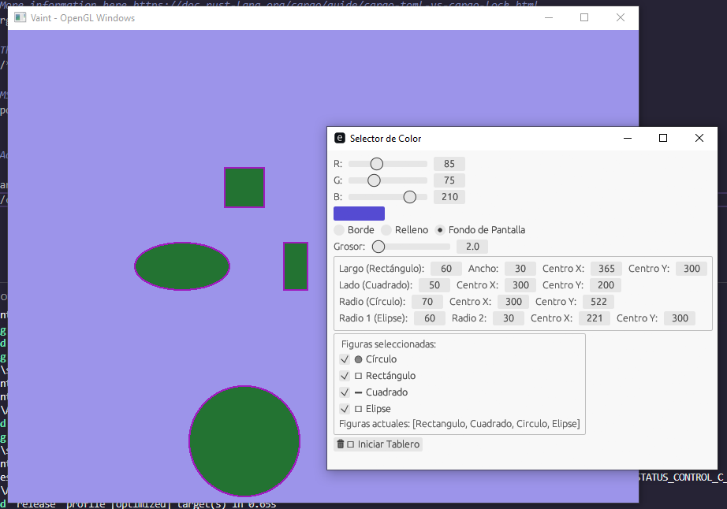

# herr_paint
 Proyecto Herramientras Graficas en Rust 2025 

# Vaint

Implementación de "Vaint" con OpenGL (Glium) y Egui

El presente trabajo consiste en el desarrollo de un programa que busca emular, en su forma más básica, la funcionalidad de un software de dibujo digital. Este proyecto tiene como objetivo principal sentar las bases de una aplicación gráfica sencilla, en la que los usuarios puedan interactuar con un lienzo virtual utilizando herramientas elementales como líneas, formas geométricas simples y selección de color. 

La idea surge como parte del estudio de la materia de Herramientas de Computación Gráfica, y se orienta a la aplicación práctica de conceptos fundamentales relacionados con la representación visual en entornos digitales. Si bien el programa no busca replicar todas las funciones complejas de un software de edición gráfica profesional, sí pretende ofrecer una estructura funcional mínima que permita experimentar con la creación de gráficos bidimensionales de manera interactiva. 

La importancia de este tipo de ejercicios radica en que permiten conectar los principios teóricos de la computación gráfica con su implementación práctica. A través del diseño y programación de esta aplicación, se adquiere una visión más clara de los desafíos que implica construir interfaces visuales desde cero, así como de las decisiones que deben tomarse en cuanto a estructura, diseño y funcionamiento general del programa. 

En resumen, este proyecto no busca ofrecer un producto final completo, sino más bien desarrollar un prototipo funcional que sirva como punto de partida para futuros avances. Su propósito es didáctico, permitiendo al desarrollador explorar las bases del dibujo digital y sentar los primeros pasos hacia la creación de herramientas gráficas más completas. 

