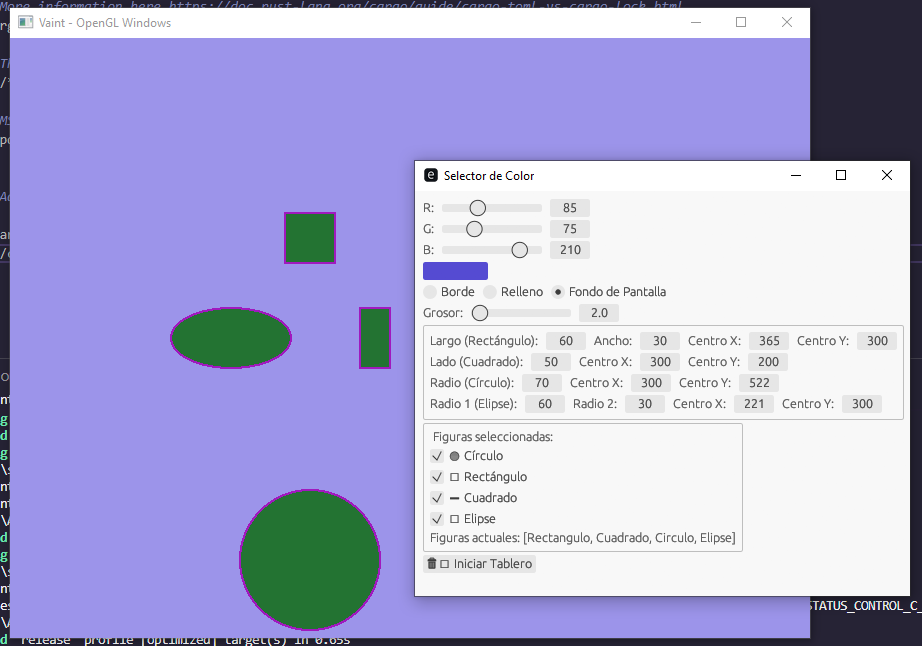

# Getting started with Vaint

1. Compile both `opengl_app` and `vaint` binaries.
2. Execute the `vaint` binary.

Note:

Both `opengl_app` and `vaint` binaries should be in the same directory.

# Example compilation commands

```bash
# Compile the OpenGL application
cargo build --release --bin opengl_app

# Compile the Vaint binary
cargo build --release --bin vaint

# Run the Vaint binary
cargo run --release --bin vaint
```

# Example of execution


